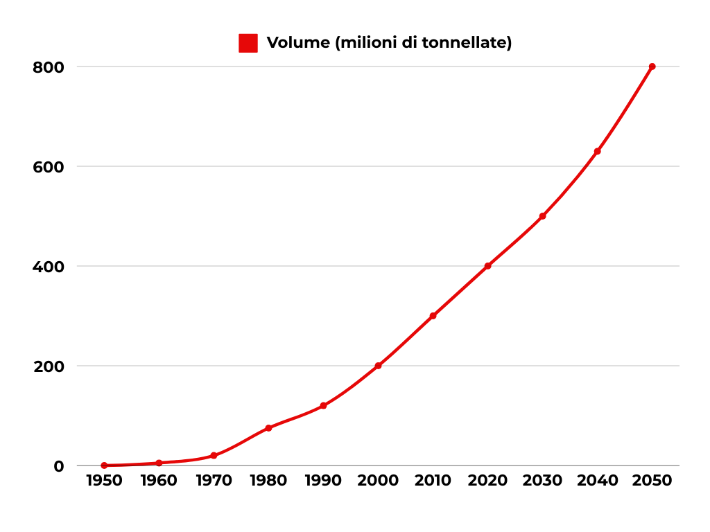
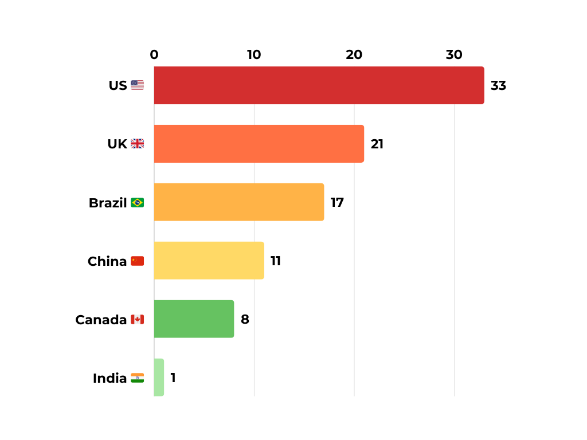

# Inquinamento da Plastica: Strategie Globali e Regionali per Salvaguardare il Nostro Futuro?

### Il Paradosso della Plastica nella Società Moderna

La plastica è divenuta un pilastro insostituibile delle economie globali, pur rappresentando uno dei maggiori problemi ambientali. La produzione globale ha superato i 400 milioni di tonnellate annue, ma gran parte di questi materiali finisce per trasformarsi rapidamente in rifiuto. I costi, in termini di salute pubblica e danni agli ecosistemi, superano di gran lunga gli evidenti benefici economici offerti dalla plastica.

Una porzione significativa della plastica prodotta ha una vita d’uso brevissima e, in mancanza di un adeguato sistema di smaltimento e riciclo, si accumula in ambienti naturali. A preoccupare è in particolare la plastica monouso, che contribuisce notevolmente all’inquinamento marino e a generare microplastiche, le quali penetrano facilmente nelle catene alimentari.

### Impatto Ambientale e Sanitario

Gli ecosistemi terrestri e marini registrano una crescente presenza di frammenti plastici che persistono per secoli. Gli studi confermano che molti pesci, mammiferi, uccelli e persino animali da allevamento possono ingerire queste particelle, subendo conseguenze sulla salute riproduttiva e sul sistema immunitario. Inoltre, alcuni additivi chimici, usati nella produzione di plastiche, possono rilasciare sostanze nocive per l'uomo, provocando disturbi endocrini e aumentando il rischio di patologie gravi.

Il problema non è circoscritto all’ambiente acquatico. In aree urbane, la frammentazione della plastica in micro e nano-particelle fa sì che esse possano disperdersi nell’aria, venire inalate o depositarsi sulle colture agricole. Gli impatti socio-economici comprendono la spesa per le bonifiche ambientali, i danni al settore del turismo e della pesca, e la diminuzione del valore delle aree costiere a causa dei rifiuti visibili.

### Prospettive di Soluzione: Economia Circolare e Bioplastiche

Un numero crescente di governi e imprese sta cercando di adottare un approccio basato sull’economia circolare: ridurre la produzione superflua di plastica, promuovere il riutilizzo e incentivare il riciclo meccanico e chimico. Ad esempio, le politiche di “plastics ban” su alcuni prodotti monouso (come le stoviglie in plastica) hanno già ridotto significativamente la dispersione di rifiuti nei mari. Al contempo, l’industria investe sempre di più nelle bioplastiche derivanti da fonti rinnovabili, in grado di degradarsi più velocemente e con un impatto minore su fauna e flora.

Tuttavia, il semplice passaggio a materiali bioplastici non è sufficiente. Molte bioplastiche non sono realmente biodegradabili in natura, e la loro corretta gestione richiede impianti specializzati di compostaggio o riciclo. Diventa quindi cruciale agire a monte, riducendo il consumo superfluo di prodotti in plastica e investendo in infrastrutture di raccolta e riciclo intelligenti. Alcuni paesi pionieri, come la Germania, mostrano come regolamentazioni vincolanti e la responsabilità estesa del produttore possano portare a risultati tangibili di riduzione dei rifiuti plastici.

## Suggerimento

Favorire la Graduale Sostituzione della Plastica con Polimeri Biodegradabili

### Ragioni

- La plastica tradizionale si decompone in tempi geologici, rilasciando microplastiche che danneggiano irrimediabilmente gli ecosistemi e potenzialmente la salute umana.
- L’introduzione di polimeri biodegradabili, certificati e realmente compostabili, riduce gli impatti sulle discariche e minimizza il rilascio di additivi chimici nell’ambiente.

### Come fare

1. Prediligi prodotti etichettati come “compostabili” e controlla che siano smaltiti in impianti idonei.
2. Sostituisci ove possibile imballaggi e utensili monouso con alternative in cellulosa o materiali naturali.
3. Sostieni politiche di ricerca e innovazione sulle bioplastiche di seconda generazione.

## Bibliografia

- *[The World of Plastic Waste: A Review](https://doi.org/10.1016/j.clema.2024.100220)*
