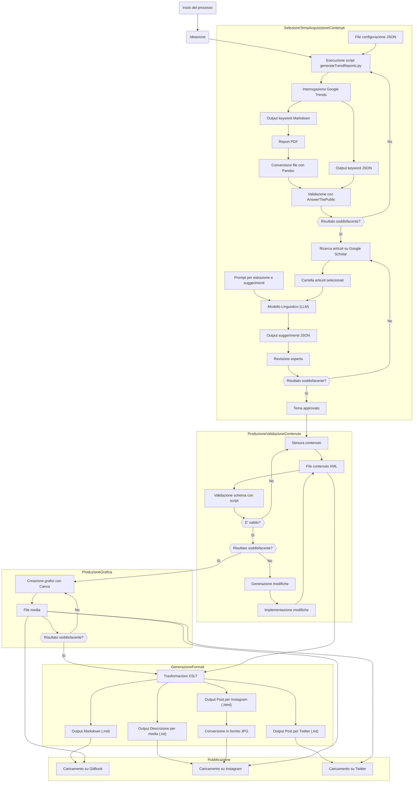

{width=100px height=100px}

# SustainAble

Esplorare il futuro sostenibile attraverso scelte consapevoli.

## Introduzione

- **Obiettivi**: informare e ispirare un pubblico giovane (18-25) sulle tematiche di sostenibilità, impatto ambientale e cambiamento climatico, offrendo soluzioni pratiche e aggiornate. Garantire una facilità di aggiornamento dei contenuti, per mantenere il progetto sempre rilevante e attuale.
- **Tecnologie**: utilizzo di script Python (per generare trend e report), piattaforme di pubblicazione multicanale (GitBook, Instagram, Twitter) e formati standard per garantire efficienza, qualità, accessibilità, interoperabilità e portabilità.
- **Flusso di gestione documentale**: definizione di un workflow che copre la fase di raccolta, validazione, produzione grafica, generazione di formati e distribuzione, con particolare attenzione alle automazioni (XSLT, Pandoc) e al controllo qualità (XSD, validazione esperto).
- **Risultati**: significativa riduzione dei tempi di produzione e dei possibili errori, miglioramento della qualità dei contenuti, copertura di nuovi canali di distribuzione e potenziale ampliamento del pubblico interessato.

## Ideazione

### Tema

Il progetto **"SustainAble"** nasce per sensibilizzare un pubblico giovane, tra i 18 e i 25 anni, sui temi cruciali del cambiamento climatico e dell'impatto ambientale delle scelte quotidiane. Questo prodotto editoriale digitale si propone di offrire contenuti coinvolgenti, accessibili e di alta qualità, allineati alle attuali tendenze di mercato e alle più recenti scoperte scientifiche.

Tra le principali domande che "SustainAble" intende affrontare, vi sono:

- Quali sono le principali cause del cambiamento climatico?
- Come posso ridurre il mio impatto ambientale a casa?
- Che cos'è l'economia circolare e come funziona?

Dall'analisi delle esigenze del pubblico giovane sono emersi specifici bisogni insoddisfatti, che il progetto si impegna a soddisfare:

1. **Accessibilità delle Informazioni**: Una forte richiesta di contenuti semplici e comprensibili, capaci di rendere accessibili tematiche complesse legate al clima e all’ambiente.
2. **Soluzioni Pratiche e Applicabili**: La necessità di guide pratiche che illustrino come adottare scelte sostenibili nella vita quotidiana, attraverso esempi concreti e facilmente realizzabili.
3. **Aggiornamenti Costanti**: L'importanza di offrire contenuti sempre aggiornati, basati sulle ultime ricerche scientifiche e sulle tendenze emergenti nel campo della sostenibilità.

Con queste priorità, "SustainAble" intende diventare un punto di riferimento per informare e ispirare una generazione impegnata nella costruzione di un futuro più sostenibile.

### Destinatari

Le personas identificate rappresentano situazioni e ruoli in cui l’uso combinato di **GitBook**, **Instagram** e **Twitter** può rendere più semplice e coinvolgente la diffusione dei messaggi sulla sostenibilità.

- Luca (22), lavoratore part-time e appassionato di moda: consulta regolarmente le storie su Instagram per scoprire i nuovi trend di moda sostenibile e rimane aggiornato su GitBook per leggere articoli più approfonditi.
- Chiara (25), neolaureata in Scienze Ambientali: trova sul webbook di GitBook studi e ricerche che approfondiscono il cambiamento climatico, ma sfrutta Twitter per seguire gli aggiornamenti in tempo reale e condividere articoli scientifici, sensibilizzando anche chi non ha dimestichezza con fonti accademiche.
- Sara (18), studentessa e molto attiva sui social media: Instagram è il canale principale per scoprire grafici e articoli che può condividere con i compagni di classe e amici. Accede poi a GitBook per approfondire le tematiche più complesse.

### Modello di fruizione

“SustainAble” adotta un approccio multicanale per coinvolgere il pubblico su più fronti: un webbook su **GitBook** e le piattaforme **Instagram** e **Twitter**, progettati per catturare l’attenzione di un’audience giovane. I contenuti, di natura scientifica e divulgativa, vengono suddivisi e adattati a ciascun canale, offrendo un’esperienza coerente e su misura.

La piattaforma **GitBook** ospita il webbook in formato Markdown, con un’interfaccia ipertestuale che facilita la navigazione non lineare e consente di approfondire rapidamente temi specifici. In parallelo, i contenuti vengono trasformati in formati adatti ai social network: su **Instagram**, con un approccio visuale che sfrutta immagini e grafici, e su **Twitter**, dove prevalgono testi con link e hashtag.

Gli utenti possono partecipare attivamente con commenti, suggerimenti e idee, sia su **GitBook** che attraverso i social.

### Canali di distribuzione

In “SustainAble”, i canali di distribuzione sono stati selezionati con l’obiettivo di coprire una vasta gamma di modalità di fruizione, assicurando al contempo una coerenza stilistica e una alta adattabilità ai diversi formati.

Il principale punto di riferimento resta GitBook, che utilizza un formato Markdown per ospitare il webbook. Questo formato facilita una consultazione ipertestuale e un aggiornamento continuo dei contenuti, permettendo agli utenti di navigare liberamente tra le varie sezioni e approfondire i temi di loro interesse.

Parallelamente, per i social network, viene sviluppata una strategia di contenuto specifica per ogni piattaforma:

- Ogni articolo viene sintetizzato in una descrizione condivisa, che funge da base per ulteriori adattamenti.
- Per piattaforme come Twitter, dove la comunicazione è più testuale, vengono creati file `.txt` arricchiti con emoji, sfruttando gli hashtag per aumentare la visibilità.
- Per piattaforme visive come Instagram, si produce un file `.html` che viene successivamente convertito in formato `.jpg`. Questo permette di integrare testo e grafica, ottimizzato per il feed visivo di Instagram.

Tutti i formati di distribuzione sono arricchiti da grafiche ad hoc, create con Canva, che rispettano le linee guida visive del progetto. Le grafiche sono minimali e informative, garantendo chiarezza e immediatezza nella comunicazione.

“SustainAble” adotta un’identità visuale così composta:

- Tonalità di verde per indicare la sostenibilità e creare associazione visiva con tematiche ambientali.
- Le grafiche sono progettate per essere essenziali e funzionali.
- Sono scelti font orientati alla leggibilità, come Sans Serif.
- Lo stile comunicativo utilizza un linguaggio chiaro e diretto, senza sacrificare la precisione e l'affidabilità delle informazioni.

## Processo di Produzione

### Acquisizione dei contenuti

Per la costruzione del prodotto editoriale digitale "SustainAble", verranno utilizzate esclusivamente fonti libere, garantendo un approccio economicamente sostenibile e legalmente conforme. In particolare, la principale risorsa per l'acquisizione dei contenuti sarà Google Scholar, una piattaforma che offre accesso a una vasta gamma di articoli accademici, report e pubblicazioni scientifiche. Inoltre, tutti i media utilizzati saranno autoprodotti per garantire originalità.
L'utilizzo degli articoli accademici disponibili su Google Scholar avverrà nel rispetto delle normative sul fair use, che consentono di integrare contenuti protetti da copyright in modo limitato e trasformativo per scopi educativi, di ricerca o di critica.

### Gestione documentale

1. **Scelta del Tema e Acquisizione dei Contenuti**
   Il processo inizia con la scelta del tema e l'acquisizione dei contenuti.

   - Generazione dei Trend Reports: Utilizzando lo script `generateTrendReports.py`, vengono analizzati i trend attuali attraverso Google Trends, basandosi su più file di configurazione `.json`. Questo script elabora le keyword più cercate, generando output in diversi formati (`.json`, `.md`, `.pdf`) tramite strumenti come `Pandoc` e `Python`.
   - Validazione dei Risultati: I report generati vengono convalidati utilizzando AnswerThePublic per verificare la soddisfazione dei risultati ottenuti. Se i risultati non sono soddisfacenti, il processo di generazione dei trend viene ripetuto per affinare le keyword selezionate.
   - Ricerca di Articoli Accademici: Una volta identificati i trend rilevanti, viene effettuata una ricerca mirata su Google Scholar per individuare articoli accademici pertinenti. Gli articoli selezionati vengono raccolti in una cartella dedicata.
   - Elaborazione tramite LLM: Utilizzando prompt specifici, un Large Language Model (LLM) estrae i punti salienti, suggerimenti e referenze dagli articoli raccolti, generando un file `.json` contenente motivi e implementazioni dei suggerimenti.
   - Revisione ed Approvazione dell'Esperto: I risultati forniti dall'LLM vengono revisionati da un esperto del settore. Se il risultato è soddisfacente, il tema viene approvato; in caso contrario, si torna alla fase di ricerca degli articoli accademici per ulteriori approfondimenti.

2. **Produzione e Validazione del Contenuto**
   Dopo l'approvazione del tema, si procede con la produzione del contenuto e la sua validazione per garantire accuratezza e conformità agli standard stabiliti.

   - Stesura del Contenuto: Il team editoriale redige il contenuto basandosi sugli articoli accademici e sui trend identificati.
   - Conversione in Formato XML: Il contenuto redatto viene scritto in formato `.xml`, facilitando la gestione strutturata dei dati e la successiva trasformazione in altri formati.
   - Validazione dello Schema: Utilizzando script di validazione, il file `.xml` viene controllato per garantire la conformità agli schemi predefiniti.
   - Se il contenuto non rispetta gli standard, si ritorna alla fase di stesura per apportare le correzioni necessarie.

3. **Produzione Grafica**

   - Creazione di Media Originali: Tutti i grafici e immagini utilizzati nel webbook sono autoprodotti utilizzando strumenti come Canva. Questo approccio garantisce l'originalità e l'unicità dei materiali visivi, evitando problematiche legate al copyright e permettendo una personalizzazione completa in linea con lo stile del progetto.

4. **Generazione dei Formati**
   Dopo la stesura dei testi in formato `.xml`, la loro validazione e la produzione degli elementi grafici, si procede alle trasformazioni `XSLT`, che convertono i contenuti in:

   - Markdown (`.md`), destinato al webbook su GitBook.
   - File `.txt`, in cui l’articolo viene arricchito di emoji e messaggi brevi, ideale per contesti più testuali come Twitter.
   - File `.html`, che contiene una presentazione più visuale pensata per Instagram; da questo file viene generata una versione `.jpg` (integrando testo e grafica in un layout fisso e accattivante) da caricare sul feed Instagram.
   - Tutti i formati prodotti vengono arricchitti dagli elementi grafici prodotti durante lo step precedente.

5. **Pubblicazione**
   L'ultima fase del flusso di gestione documentale è la pubblicazione dei contenuti:
   - Upload su GitBook.
   - Upload su Instagram.
   - Upload su Twitter.

### Tecnologie adottate

| **Tecnologia**                 | **Descrizione/Utilizzo**                                                                                                                            |
| ------------------------------ | --------------------------------------------------------------------------------------------------------------------------------------------------- |
| **Python**                     | Script Python utilizzati per creare script per generare report/validatori...                                                                        |
| **Google Trends**              | Servizio online per analizzare le keyword più cercate e identificare trend attuali                                                                  |
| **Pandoc**                     | Strumento di conversione dei formati dei file, utilizzato per trasformare report in `.json`, `.md` e `.pdf`                                         |
| **AnswerThePublic**            | Strumento per validare i risultati dei trend e ottenere ulteriori insight sui temi                                                                  |
| **Google Scholar**             | Motore di ricerca per articoli accademici, utilizzato per trovare contenuti pertinenti                                                              |
| **Large Language Model (LLM)** | Modello di linguaggio utilizzato per estrarre punti salienti, fornire suggerimenti dagli articoli accademici e supportare la stesura dei contenuti. |
| **XML**                        | Formato di file utilizzato per strutturare i contenuti editoriali                                                                                   |
| **XSLT**                       | Tecnica di trasformazione usata per convertire file XML in Markdown (`.md`)                                                                         |
| **Canva**                      | Strumento di design grafico utilizzato per produrre grafici, infografiche e altri media visivi                                                      |
| **GitBook**                    | Piattaforma per la pubblicazione e distribuzione del webbook digitale                                                                               |
| **Mermaid.js**                 | Libreria JavaScript per il rendering di diagrammi nei contenuti (con limitazioni in alcuni editor)                                                  |
| **XSD**                        | Schema XML utilizzato per definire la struttura e le regole dei file XML, garantendo la validità e la conformità                                    |
| **Markdown**                   | Formato testuale leggibile e semplice per rappresentare i contenuti del webbook, compatibile con GitBook                                            |
| **PDF**                        | Formato per documenti statici utilizzato per generare report e contenuti accessibili offline                                                        |
| **JSON**                       | Formato di dati leggibile da macchine, utilizzato per salvare configurazioni, risultati dei trend e suggerimenti                                    |
| **lxml**                       | Libreria Python utilizzata per verificare la validità di un file XML rispetto al suo schema (XSD)                                                   |
| **TrendReq**                   | Modulo di `pytrends` utilizzato per ottenere dati sui trend da Google Trends                                                                        |
| **Pandas**                     | Libreria Python usata per elaborare e analizzare i risultati ottenuti da TrendReq                                                                   |
| **PyPDF2**                     | Libreria utilizzata per la conversione e la manipolazione di file PDF                                                                               |

### Esecuzione del flusso

Tutti i materiali, gli script, le configurazioni e i prototipi necessari per riprodurre il flusso di produzione documentale sono disponibili sul repository GitHub al seguente link:

[repository](https://github.com/lcvcn/SustainAble)

Nel repository sono presenti:

- Gli script per l'automazione delle fasi di acquisizione, produzione e validazione dei contenuti.
- I file di configurazione necessari per gestire i diversi formati di destinazione.
- Prototipi per ogni tipologia di contenuto e formato previsto.

## Valutazione dei risultati raggiunti

### Valutazione del flusso di produzione

Il flusso di produzione proposto per "SustainAble" offre i seguenti vantaggi:

1. Riduzione dei tempi di gestione documentale:

   - L’utilizzo di script Python, come `generateTrendReports.py`, velocizza l’estrazione dei trend e delle keyword da Google Trends, automatizzando processi complessi e riducendo l'intervento manuale.
   - Le Trasformazioni ottimizzano il processo di conversione, riducendo i tempi per produrre i formati richiesti per la pubblicazione.
   - La pubblicazione su GitBook, Instagram e Twitter può essere ulteriormente migliorata strutturando una pipeline semi-automatizzate (ad esempio con GitHub Actions o workflow dedicati), riducendo i passaggi manuali.

2. Riduzione degli errori:

   - La validazione tramite lxml e XSD assicura che il documento XML rispetti gli standard, minimizzando errori di struttura e di formattazione.
   - L’uso di modelli LLM permette di estrarre rapidamente i contenuti più importanti e di creare sintesi standardizzate, ma è comunque necessario un controllo finale da parte di una persona per garantirne l’accuratezza.

3. Miglioramento della qualità dei documenti:

   - La presenza di un esperto che approva i contenuti estratti dal LLM garantisce la correttezza e l’affidabilità delle informazioni.
   - L’impiego di grafiche originali (Canva) migliora l’estetica.
   - Grazie ai processi di trasformazione, si ottiene una grafica e uno stile coerente su tutte le pubblicazioni, eliminando la necessità di revisionare ogni formato per ogni canale di distribuzione. Il controllo dello stile è centralizzato, garantendo uniformità e qualità costante.

4. Miglioramento del livello di accettazione della tecnologia:

   - Instagram e Twitter sono strumenti già ampiamente conosciuti e intuitivi per la maggior parte degli utenti.
   - GitBook, essendo accessibile via web e con un'interfaccia chiara, permette agli utenti di navigare, contribuire e leggere documenti in modo semplice, indipendentemente dal dispositivo utilizzato.
   - GitBook facilita l’editing collaborativo, permettendo ai team di lavorare insieme in modo asincrono o in tempo reale.

5. Raggiungimento di nuovi canali di distribuzione:

   - L’integrazione di Instagram e Twitter, oltre alla tradizionale pubblicazione su WebBook, permette una diffusione più ampia e diversificata dei contenuti.
   - I contenuti sono presenti sia in formato testuale sia in formato visivo, massimizzando il bacino di utenza.

6. Soddisfacimento di nuovi scenari d’uso:
   - Gli utenti possono fruire del contenuto completo tramite WebBook, mentre chi preferisce aggiornamenti rapidi e contenuti interattivi sfrutta Instagram e Twitter.
   - Gli utenti più interessati o i professionisti del settore possono risalire alle fonti degli articoli accademici per approfondimenti, mentre i contenuti social possono essere adattati per una divulgazione rapida e immediata.

### Confronto con lo stato dell'arte

“SustainAble” si confronta con organizzazioni internazionali come WWF e Greenpeace. Il WWF utilizza una vasta gamma di contenuti multimediali di alta qualità, inclusi video educativi e documentari su YouTube, grafiche dettagliate e campagne su numerosi social media come Instagram, Twitter e Facebook. Greenpeace, similmente, promuove campagne virali e interattive, sfruttando YouTube per documentari e video informativi, oltre a webinar e live streaming.

Queste organizzazioni dispongono inoltre di un branding robusto e un design professionale che rafforza la percezione di autorevolezza.

Sebbene “SustainAble” abbia implementato una strategia multicanale integrando GitBook con Instagram e Twitter, manca di alcune caratteristiche avanzate offerte dai competitor, come un canale YouTube per la diffusione di video e una identità grafica più sofisticata.

Tuttavia, “SustainAble” presenta punti di forza significativi, come l'approccio basato sui trend e l'uso di pubblicazioni scientifiche recenti, che forniscono un punto di riferimento solido in un contesto (social) caratterizzato da disinformazione. Questo garantisce che i contenuti siano rilevanti, aggiornati e basati su dati concreti.

#### AS-IS

- Raccolta delle informazioni manuale (Google Trends consultato via web e trascrizione dei dati su documenti locali...).
- Nessun controllo automatico della validità dei contenuti (assenza di XSD e validazioni).
- Produzione di report e contenuti finali in modo manuale (ad es. con editor di testo), con un alto rischio di disallineamenti tra versioni.
- Pubblicazione su singolo canale (ad es. solo su un sito web statico), senza ottimizzazione multicanale.

#### TO-BE

- Automatizzazione di gran parte del processo grazie a script Python (ad esempio per generare i report da Google Trends e validare i contenuti).
- Validazione strutturale con XML/XSD, riducendo la possibilità di errori formali.
- Conversione in molteplici formati (PDF, Markdown, HTML, TXT) in modo automatizzato attraverso XSLT e Pandoc, riducendo le tempistiche di rework.
- Pubblicazione multicanale: GitBook per il webbook completo, Instagram e Twitter per la promozione e la diffusione rapida di contenuti, garantendo coerenza tra i diversi canali _(Instagram e Twitter sono esempi esemplificativi, ma i formati prodotti sono riutilizzabili per molteplici social)_.

### Limiti emersi

#### Accesso limitato a determinate API

- Google Trends e alcuni servizi (es. AnswerThePublic) possono imporre restrizioni sull’uso dell’API (le API utilizzate per i dati di Google Trends non sono ufficiali).
- L’accesso programmatico a Instagram e Twitter può essere soggetto a politiche API che cambiano spesso.

#### Automazione non totale

- La revisione umana dei contenuti, soprattutto quelli prodotti da LLM rimane essenziale per garantire accuratezza e credibilità.
- Alcune fasi di creazione dei post (specie i contenuti visuali per Instagram) potrebbero richiedere più intervento manuale.

#### Limiti di integrazione

- Integrare un workflow continuo tra GitBook, Instagram e Twitter non è semplice. Spesso si devono usare script fatti su misura, fare passaggi manuali o appoggiarsi a servizi esterni.
- La **personalizzazione del layout su GitBook** può risultare meno flessibile rispetto ad altre piattaforme più “libere”.

## Conclusioni

Il progetto “SustainAble” dimostra come l’integrazione tra formati aperti, stili editoriali diversificati e strategie di distribuzione multicanale possa facilitare la diffusione di contenuti ambientali e scientifici a un pubblico variegato

L’uso dei social network risulta complementare alla piattaforma GitBook: da un lato, i contenuti su Twitter e Instagram creano engagement e coinvolgimento immediati; dall’altro, il webbook mette a disposizione un archivio ordinato e navigabile che dà profondità al progetto. Tali canali, allineati da uno stile coerente e dall’uso sapiente della grafica, migliorano la riconoscibilità e la credibilità di “SustainAble”.

La gestione documentale, basata su un flusso automatizzato di generazione e validazione dei formati, ha contribuito a:

- Ridurre i tempi di produzione, grazie all’automazione e alla validazione centralizzata.
- Diminuire gli errori, poiché ogni fase è soggetta a controlli e ogni contenuto è gestito in modo strutturato.
- Aumentare la qualità e la consistenza dei documenti, grazie a regole editoriali uniche e grafiche create su misura.
- Rendere il contenuto facilmente aggiornabile, grazie alla centralizzazione dei file sorgente e alla struttura modulare che consente modifiche rapide ed efficienti.

Nonostante alcuni limiti, come la necessità di supervisione umana e di aggiornamenti costanti delle API social, i risultati raggiunti permettono di affermare che “SustainAble” abbia raggiunto gli obiettivi prefissati. Tuttavia, è importante riconoscere che il progetto è ancora lontano da prodotti editoriali di riferimento nel settore della sostenibilità, come quelli realizzati da organizzazioni internazionali quali WWF o Greenpeace, che dispongono di risorse e competenze avanzate. A causa del tempo limitato a disposizione e delle competenze tecniche, la parte grafica di “SustainAble” potrebbe essere notevolmente migliorata.

Nonostante queste limitazioni, “SustainAble” rappresenta un buon punto di partenza nel panorama. Ritengo l'idea di partire da un’analisi dei trend e di utilizzare pubblicazioni scientifiche recenti in un contesto caratterizzato da una diffusione massiccia di disinformazione fornisce un punto di riferimento solido e affidabile. Questo approccio contribuisce a creare contenuti autenticati e basati su dati concreti, aumentando la credibilità e l’impatto educativo del progetto.

## Bibliografia e sitografia

[@googleTrends,@answerThePublic,@gitBook,@WWF,@Greenpeace,@Instagram,@Twitter,@Canva,@pilapitiya2024]
